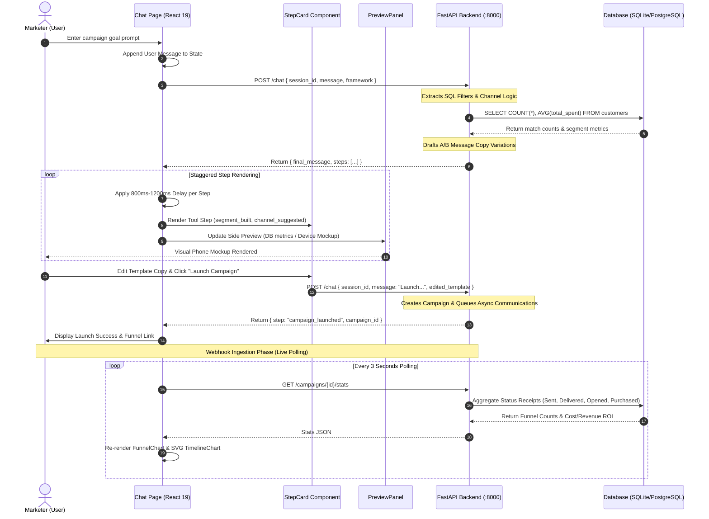

# Nexora Frontend — Master Technical Documentation & Interview Blueprint

> **Target Audience**: Senior Engineers & Tech Leads with strong backend/fullstack backgrounds.  
> **Language**: Plain Hinglish + Precise Technical English.  
> **Project**: Nexora — AI-Native Campaign Orchestration & Real-Time Nexoran CRM (Frontend).

---

## 1. Executive Summary & High-Level System Architecture

### 1.1 Core Purpose & Problem Statement

Traditional enterprise CRMs (Salesforce, HubSpot, Braze) force marketers and campaign managers to navigate complex, multi-step user interfaces to build customer segments, draft multi-channel communications, select optimal delivery channels, and execute campaign dispatches. This creates significant friction and delayed time-to-market.

**Nexora Frontend** solves this problem by providing a **Chat-First, AI-Native Campaign Copilot & Real-Time Analytics CRM**. Marketers simply state their high-level campaign goal in plain English (e.g., _"Win back inactive customers who haven't ordered in 45 days with a 15% discount code"_).

The frontend seamlessly orchestrates:

1. **Natural Language Goal Parsing & Database Segmentation**: Communicating with FastAPI microservices to extract denormalized SQL parameters.
2. **Dynamic Multi-Channel Routing**: Recommending delivery channels (WhatsApp vs SMS vs Email) based on audience size and average spend metrics.
3. **Context-Aware Copywriting**: Displaying AI-generated A/B message variations with real-time token substitution (`{{name}}`, `{{discount_code}}`).
4. **Interactive Approval & Async Dispatch**: Initiating non-blocking campaign dispatches.
5. **Real-Time Funnel Analytics & Webhook Ingestion**: Polling and rendering live webhook receipts (Sent $\rightarrow$ Delivered $\rightarrow$ Opened $\rightarrow$ Clicked $\rightarrow$ Purchased) with SVG charts and interactive simulation engines.

```
+---------------------------------------------------------------------------------------------------+
|                                      nexora FRONTEND APP                                       |
|                                                                                                   |
|  +------------------------+  +------------------------+  +------------------------------------+  |
|  |     Marketing Landing   |  |   AI Campaign Copilot  |  |    Live Analytics Dashboard        |  |
|  |     (Interactive Tour) |  |   (Chat 60/40 Split UI)|  |    (Real-time Webhook Polling)     |  |
|  +-----------+------------+  +-----------+------------+  +-----------------+------------------+  |
|              |                           |                             |                      |
|              +---------------------------+-----------------------------+                      |
|                                          |                                                    |
|                                          v                                                    |
|                        +-----------------------------------+                                  |
|                        | Next.js 16 (App Router) + React 19|                                  |
|                        | Tailwind CSS v4 + Lucide React    |                                  |
|                        +-----------------+-----------------+                                  |
+------------------------------------------|----------------------------------------------------+
                                           | HTTP / REST (Fetch API)
                                           v
                        +-----------------------------------+
                        |   FastAPI Backend (Port 8000)     |
                        |   SQLite / PostgreSQL + Webhooks  |
                        +-----------------------------------+
```

### 1.2 Core User Personas

- **Growth Marketer**: Uses the AI Copilot to quickly generate segments, draft message variants, and launch targeted retention campaigns.
- **Campaign Operations Lead**: Monitors aggregate revenue recovery metrics, ROI percentages, conversion rates, and delivery funnels across launched workflows.
- **CRM Administrator / Engineer**: Inspects customer activity rooms, triggers manual database re-seeding, and reviews full-stack system architecture simulations.

### 1.3 Key Technical Highlights

- **Framework**: Next.js 16.2 (App Router architecture with TypeScript 5).
- **UI Library**: React 19.2 (using React Fiber Automatic Batching, Client Boundaries, and `useTransition`).
- **Styling System**: Tailwind CSS v4 using the native `@theme` directive, custom HSL-remapped accessible color contrast tokens, and CSS glassmorphism.
- **Data Visualization**: Custom zero-dependency SVG plotting engines (`TimelineChart`), responsive CSS funnel bar calculations, and an embedded 83KB Canvas/DOM simulation environment (`conversio_simulation.html`).
- **State Strategy**: Zero external bloat (No Redux/Zustand required). Pure React Local State + URL Query Parameters (`useSearchParams`) + Async Progressive Thread State + Dual Engine Isolation (Custom Engine vs LangChain Engine).

---

## 2. Exhaustive File-by-File & Code Breakdown (EVERY SINGLE FILE)

Neeche codebase ki **HAR EK FILE** ki complete line-by-line aur section-by-section engineering breakdown di gayi hai.

```
frontend/
├── .env.local
├── .gitignore
├── AGENTS.md
├── CLAUDE.md
├── eslint.config.mjs
├── next-env.d.ts
├── next.config.ts
├── package-lock.json
├── package.json
├── postcss.config.mjs
├── README.md
├── tsconfig.json
├── tsconfig.tsbuildinfo
├── app/
│   ├── favicon.ico
│   ├── globals.css
│   ├── layout.tsx
│   ├── page.tsx
│   ├── campaigns/[id]/page.tsx
│   ├── chat/page.tsx
│   ├── customers/page.tsx
│   ├── dashboard/page.tsx
│   └── simulation/page.tsx
├── components/
│   ├── FunnelChart.tsx
│   ├── MarkdownRenderer.tsx
│   ├── OpportunityCard.tsx
│   ├── PreviewPanel.tsx
│   └── StepCard.tsx
└── public/
    ├── conversio_simulation.html
    ├── file.svg
    ├── globe.svg
    ├── next.svg
    ├── vercel.svg
    └── window.svg
```

---

### 2.1 Configuration & Environment Files

#### 1. `frontend/package.json`

- **Use / Purpose**: Project's core dependency manifest, script registry, and version requirements.
- **Section Analysis**:
  - `scripts` (lines 5-10): Defines `dev` (`next dev`), `build` (`next build`), `start` (`next start`), and `lint` (`eslint`).
  - `dependencies` (lines 11-17): Pinpoints `next: "16.2.7"`, `react: "19.2.4"`, `react-dom: "19.2.4"`, `lucide-react: "^1.17.0"` (vector icons), and `uuid: "^14.0.0"` (RFC-compliant UUIDv4 generation for chat sessions).
  - `devDependencies` (lines 18-28): Includes `@tailwindcss/postcss: "^4"`, `tailwindcss: "^4"`, `typescript: "^5"`, and ESLint 9 configuration.
- **Inputs & Outputs**: Input for `npm install` and Next.js bundler; Outputs runtime node module dependency tree.

#### 2. `frontend/next.config.ts`

- **Use / Purpose**: Next.js framework configuration file exported as a strongly-typed `NextConfig` object.
- **Section Analysis**: Exports default empty configuration object ready for custom headers, redirect rules, or webpack/turbopack overrides.
- **Inputs & Outputs**: Consumed by `@next/swc` / Next.js compiler engine during development and production build stages.

#### 3. `frontend/tsconfig.json`

- **Use / Purpose**: TypeScript compiler settings specifying type checking strictness, JSX transform, and module path aliasing.
- **Section Analysis**:
  - `compilerOptions.target`: `"ES2017"` guarantees modern JavaScript features (async/await, object spread).
  - `compilerOptions.strict`: `true` enforces zero implicit `any` types, strict null checks, and strict function types.
  - `compilerOptions.paths`: Maps `@/*` to `./*` enabling clean absolute imports across the codebase.
- **Inputs & Outputs**: Read by TypeScript Language Server (`tsserver`) and Next.js build compiler.

#### 4. `frontend/.env.local`

- **Use / Purpose**: Local environment variables configuration.
- **Section Analysis**: Sets `NEXT_PUBLIC_API_URL=http://localhost:8000`. The `NEXT_PUBLIC_` prefix exposes this variable to client-side browser bundles.
- **Inputs & Outputs**: Injected into `process.env.NEXT_PUBLIC_API_URL` during React component rendering.

#### 5. `frontend/postcss.config.mjs`

- **Use / Purpose**: PostCSS plugin pipeline configuration.
- **Section Analysis**: Imports and registers `@tailwindcss/postcss` plugin to support Tailwind CSS v4's high-performance CSS parsing engine.

#### 6. `frontend/eslint.config.mjs`

- **Use / Purpose**: Flat ESLint configuration file defining static analysis and linting rules.
- **Section Analysis**: Merges `eslint-config-next/core-web-vitals` and TypeScript rulesets while explicitly ignoring `.next/`, `out/`, and build artifacts.

#### 7. `frontend/AGENTS.md`

- **Use / Purpose**: Internal documentation file providing guidelines for AI coding agents regarding Next.js breaking changes and directory rules.

#### 8. `frontend/CLAUDE.md`

- **Use / Purpose**: Pointer file linking to `@AGENTS.md`.

#### 9. `frontend/README.md`

- **Use / Purpose**: Standard project setup instructions for starting the dev server (`npm run dev`) and deployment guidelines.

#### 10. `frontend/next-env.d.ts`

- **Use / Purpose**: TypeScript declaration file auto-generated by Next.js ensuring global browser and Node types are recognized.

---

### 2.2 Root App Layout & Styling Files

#### 11. `frontend/app/layout.tsx`

- **Use / Purpose**: Root Layout Component (`RootLayout`) wrapping every page in the application. Provides global HTML structure, fonts, header navigation, ambient glowing background graphics, and footer.
- **Line-by-Line Code Analysis**:
  - Line 1: `"use client";` directive enables client-side interactive routing hooks like `usePathname`.
  - Lines 8-11: Instantiates Google `Inter` font subsetting latin characters into variable `--font-sans`.
  - Line 18: `const pathname = usePathname();` captures active URL path to apply conditional styles and layout boundaries.
  - Lines 24-50: Render fixed ambient dot-grid pattern SVG `<pattern id="global-dot-grid">` combined with two glowing blurred background radial gradient blobs (`bg-indigo-300/20` and `bg-purple-300/20`).
  - Lines 53-123: Sticky glassmorphic header (`backdrop-blur-md bg-white/80`) displaying **Nexora Copilot** branding and dynamic navigation links (`/`, `/dashboard`, `/chat`, `/customers`, `/simulation`). Active path is indicated by a smooth sliding indicator `<span className="absolute bottom-0 left-0 right-0 h-0.5 bg-indigo-600 rounded-full animate-fade-in" />`.
  - Lines 126-134: Conditional main content container styling. When on `/simulation`, it occupies full screen height (`h-[calc(100vh-3.5rem)] overflow-hidden`); on other routes, it applies standard centered constraints (`max-w-7xl px-4 py-8`).
- **Inputs & Outputs**:
  - _Props_: `{ children: React.ReactNode }`
  - _Outputs_: Complete HTML document wrapper with sticky navbar and global background system.

#### 12. `frontend/app/globals.css`

- **Use / Purpose**: Global design system stylesheet defining Tailwind CSS v4 design tokens, color palette overrides, micro-animations, and scrollbar modifications.
- **Section Analysis**:
  - `@import "tailwindcss";` imports Tailwind v4 engine.
  - `@theme` block (lines 3-53): Remaps standard zinc colors to guarantee WCAG AA 4.5:1 contrast compliance (e.g. `--color-zinc-400: #5b5b66`, `--color-zinc-500: #45454d`). Introduces custom brand tokens (`--color-indigo-550`, `--color-indigo-850`, `--color-emerald-650`).
  - Accessibiltiy (`*:focus-visible`, lines 56-60): Applies mandatory indigo focus outline (`2.5px solid #4f46e5`) for keyboard navigation.
  - Micro-Animations (`@keyframes pulse-slow`, lines 89-96): Custom 2-second smooth opacity pulse for live status indicators.
  - `.no-scrollbar` (lines 99-106): Hides scrollbars across WebKit, Firefox, and IE/Edge.

---

### 2.3 Page Components

#### 13. `frontend/app/page.tsx` (`MarketingLandingPage`)

- **Use / Purpose**: The marketing homepage providing a high-impact product landing experience, interactive 5-stage campaign pipeline tour, fullscreen simulation frame preview, and technical capability feature cards.
- **Section Analysis**:
  - `SAMPLE_GOALS` array (lines 24-73): Mock data containing pre-configured campaign objectives (_Win Back Inactive Customers_, _Reward Frequent Loyal Buyers_, _Offer High-Value Spenders 50% Off_), with extracted parameters, audience counts, channel selection reasons, A/B copy variants, and ROI metrics.
  - State Hooks (lines 76-78): `activeStep` (tracks selected stage 0-4 in interactive tour), `selectedGoal` (currently active sample goal object), `typedMessage` (controlled textarea state).
  - Hero Section (lines 115-172): Bold typography with linear gradient text mask (`bg-gradient-to-r from-indigo-650 to-purple-650 bg-clip-text text-transparent`) and direct CTAs to `/chat` and `/dashboard`.
  - Stage 1-5 Tour Stage Viewer (lines 222-396):
    - _Stage 0 (Define Goal)_: Interactive prompt editor triggering `handleSelectGoal()`.
    - _Stage 1 (Query Segment)_: Displays JSON extracted filters and database query output.
    - _Stage 2 (Choose Channel)_: Shows intelligent channel routing logic (WhatsApp vs SMS vs Email).
    - _Stage 3 (Generate Copy)_: Displays generated Variant A & Variant B templates with token variables.
    - _Stage 4 (Dispatch & Funnel)_: Summarizes segment cost, converted orders, recaptured revenue, and ROI percentage.
  - Embedded Simulation (lines 437-461): Embeds `/conversio_simulation.html` inside a responsive iframe with a quick button link to fullscreen `/simulation`.
- **Inputs & Outputs**: Renders public landing page; passes selected sample goal text via router navigation.

#### 14. `frontend/app/dashboard/page.tsx` (`DashboardPage`)

- **Use / Purpose**: Main analytics command center showing top-level CRM KPIs, latest campaign funnel performance, dynamic AI opportunity recommendations, recent campaigns data table, and database management modal.
- **Line-by-Line Code Analysis**:
  - State Hooks (lines 52-84): `oppData` (opportunity response schema), `campaigns` (array of campaign summaries), `latestLaunchedCampaign` & `latestStats` (cached statistics for the active campaign funnel), `isManageModalOpen`, `resetType` (`"campaigns"` | `"database"`), `confirmInput` (validation text).
  - `fetchDashboardData()` (lines 108-140): Async call fetching `/campaigns`. Identifies the most recent launched campaign (`c.status !== "draft"`) and immediately triggers a secondary fetch to `/campaigns/${launched.id}/stats`.
  - Live Polling Effect (lines 182-204): `useEffect` checking if `latestLaunchedCampaign?.status === "launched"`. Instantiates `setInterval(fetchLatestStats, 3000)` to update funnel numbers every 3 seconds without full page reload. Cleans up interval on unmount.
  - `handleExecuteReset()` (lines 151-178): Executes destructive API calls to `/campaigns/reset` (wipes campaign history) or `/campaigns/reset-db` (re-seeds baseline 400 Indian customer profiles) after verifying user confirmation text (`"RESET"` or `"RESEED"`).
  - Top Aggregate Stats (lines 310-373): 3 metric cards displaying **Addressable Recovery (₹)**, **Targetable Audience**, and **Total Campaigns**.
  - 60/40 Grid Layout (lines 376-486):
    - Left (60%): Renders `<FunnelChart stats={latestStats} />` if a campaign is active; otherwise displays empty state CTA.
    - Right (40%): Maps top 3 `<OpportunityCard />` elements with an **AI Refresh** button invoking `/opportunities?refresh=true`.
  - Database Management Modal (lines 557-702): Backdrop blur modal supporting single-click state reset with confirmation validation safeguards.

#### 15. `frontend/app/chat/page.tsx` (`ChatPage`)

- **Use / Purpose**: The core AI Campaign Copilot interface. Provides real-time chat thread interaction, dual agent engine toggle, progressive step-by-step tool rendering, live A/B template editing, cursor token insertion, in-place message draft regeneration, and side-by-side visual preview panel.
- **Line-by-Line Code Analysis**:
  - Wraps `ChatPageContent` in React 19 `<Suspense>` boundary (lines 636-648) to handle URL query parameter parsing via `useSearchParams()`.
  - State & Refs (lines 26-47):
    - `sessionId`: Dynamic UUIDv4 string generated on mount.
    - `messages`: Array of `Message` objects containing text and optional array of `StepData`.
    - `agentFramework`: Switchable state (`"custom"` | `"langchain"`).
    - `customSessionId` / `langchainSessionId`: Isolated session IDs maintained in memory so switching engine modes preserves distinct conversation histories.
    - `goalProcessed`: React `useRef(false)` flag guarding against React 18/19 StrictMode double-execution when parsing deep-linked URL parameters (`?goal=...&retarget=true`).
  - Deep-Linked Retargeting Logic (lines 83-138): Checks if `retarget === "true"`. Fetches `/campaigns/${targetCampaignId}/stats`, calculates non-openers (`delivered - opened`), and automatically populates the chat prompt with a retargeting recommendation.
  - `handleSendMessage()` (lines 180-299):
    - Appends user message bubble to thread.
    - Sends POST request to `/chat` with `{ session_id, message, edited_template, agent_framework }`.
    - Parses array of returned steps (`data.steps`).
    - **Progressive Stagger Loop**: Iterates through steps with async delays (`await new Promise(r => setTimeout(r, delay))`), incrementally pushing steps into the assistant message bubble to simulate real-time AI tool execution.
  - In-Place Regeneration `handleRegenerateMessages()` (lines 316-375): Triggered from `StepCard`. Sends regeneration query to `/chat` and updates the target message bubble **in-place** using JavaScript `.map()`, replacing only `message_generated` and `campaign_preview` steps while keeping prior database steps intact.
  - Layout Structure (lines 508-634): Responsive 60/40 desktop split grid.
    - Left 60%: Chat conversation thread with auto-scrolling (`threadEndRef`), markdown renderer, step cards, and fixed bottom input bar with token shortcut badges.
    - Right 40%: `<PreviewPanel />` rendering real-time phone mockups (WhatsApp/SMS/Email) or segment query summaries based on the active copilot step.

#### 16. `frontend/app/customers/page.tsx` (`CustomersPage`)

- **Use / Purpose**: Comprehensive customer management directory allowing growth engineers to search, filter by channel preference or segment tags, and open a slide-in drawer ("Marketer's Customer Room") displaying order histories and campaign dispatch logs.
- **Section Analysis**:
  - State Hooks (lines 53-66): `customers` (array of `CustomerSummary`), `searchTerm`, `selectedChannel`, `selectedTag`, `selectedCustomerId`, `activityData` (`CustomerActivityResponse`).
  - Client-Side Filtering (lines 111-118): Performs instantaneous case-insensitive substring matching against customer `name`, `email`, and `phone` numbers.
  - Customer Room Drawer (lines 369-570):
    - Appears on the right side when a customer row is clicked.
    - Fetches detailed customer timeline via `/customers/${id}/activity`.
    - Displays total LTV (Spent), Order Count, Average Ticket Size (`total_spent / total_orders`).
    - Tabbed Interface (_Orders_ vs _Campaign Runs_): Displays detailed item lists for orders and communication dispatch logs with status badges (`sent`, `delivered`, `opened`, `purchased`, `failed`).

#### 17. `frontend/app/campaigns/[id]/page.tsx` (`CampaignDetailPage`)

- **Use / Purpose**: In-depth analytics dashboard for a specific campaign ID. Renders ROI metrics, real-time funnel breakdown, dynamic SVG timeline event graph, AI performance insight generator, dispatch logs with manual webhook event simulation, and message preview modals.
- **Section Analysis**:
  - `TimelineChart` Component (lines 58-131): Custom inline SVG component plotting event frequencies over time. Calculates dynamic scaling ratios:
    $$\text{y\_coord} = \text{padding} + \text{chartHeight} - \left(\frac{\text{event\_count}}{\text{max\_val}}\right) \times \text{chartHeight}$$
    Draws multi-colored SVG `<polyline>` elements for **Sent** (indigo), **Delivered** (blue), and **Opened** (emerald).
  - Dynamic AI Performance Insight (lines 460-468): Synthesizes campaign metrics into a prompt and posts to `/chat` with session ID `insight-${campaignId}` to generate a natural language executive verdict.
  - Dispatch Table & Event Simulation (lines 790-955):
    - Deduplicates recipient logs by customer name while maintaining communication fallback chains (`WhatsApp ➔ SMS`).
    - Provides interactive simulation buttons (**Deliver**, **Open**, **Click**, **Purchase**, **Fail**) that trigger POST requests to `/receipts`, immediately executing backend ACID transactions and refreshing local stats.
  - Personalized Message Modal (lines 958-1018): Renders an overlay popup showing exact personalized message copy styled as a WhatsApp business chat box, iMessage text bubble, or rich Email layout.

#### 18. `frontend/app/simulation/page.tsx` (`SimulationPage`)

- **Use / Purpose**: Clean fullscreen route embedding `/conversio_simulation.html` in a 100% viewport height iframe.

---

### 2.4 Reusable UI Components

#### 19. `frontend/components/FunnelChart.tsx`

- **Use / Purpose**: Reusable campaign conversion funnel visualization component.
- **Section Analysis**:
  - Calculates proportional conversion rates:
    - $\text{Delivery Rate} = (\text{Delivered} / \text{Sent}) \times 100$
    - $\text{Open Rate} = (\text{Opened} / \text{Delivered}) \times 100$
    - $\text{Click Rate} = (\text{Clicked} / \text{Opened}) \times 100$
    - $\text{Purchase Rate} = (\text{Purchased} / \text{Clicked}) \times 100$
  - Renders 5 horizontal stacked funnel bars with custom colors (Zinc $\rightarrow$ Indigo $\rightarrow$ Amber $\rightarrow$ Blue $\rightarrow$ Emerald).
  - Bottom KPI Grid (lines 143-168): Displays summary percentages for Delivery Success, Open Rate, Click Rate, and Net ROI Nexoran.

#### 20. `frontend/components/MarkdownRenderer.tsx`

- **Use / Purpose**: Custom, zero-dependency Markdown parsing and rendering engine. Renders Markdown text, lists, headers, inline formatting, and GitHub Flavored Markdown (GFM) tables without external security risks or library bloat.
- **Section Analysis**:
  - `parseMarkdown()` function (lines 20-172): Implements a state-machine tokenizer using line-by-line lookahead.
    - _Table Tokenizer_: Detects pipe delimiters (`|`). Looks ahead at index `i+1` for separator lines (`|---|---|`), parses column alignments (`:---:`, `---:`), and extracts row cells into a structured AST block array (`Block[]`).
    - _Header Tokenizer_: Matches regex `/^(#{1,6})\s+(.*)$/`.
    - _List Tokenizer_: Matches unordered (`*`, `-`) and ordered (`1.`) lists.
  - `formatInlineText()` function (lines 175-209): Splitting text using regex `(/(\*\*.*?\*\*|`._?`|\*._?\*)/g)`to wrap text in`<strong>`, `<code>`, or `<em>` React nodes.
  - Cell Badging (`renderTableCell()`, lines 214-295): Contextually transforms text:
    - Converts rank numbers (`1`, `2`, `3`) into styled medals (**1st**, **2nd**, **3rd**).
    - Formats channel names (`WhatsApp`, `SMS`, `Email`) into colored pill badges.
    - Formats ISO dates and INR currency strings (`₹`).

#### 21. `frontend/components/OpportunityCard.tsx`

- **Use / Purpose**: Visual card displaying AI-identified revenue opportunities on the dashboard.
- **Section Analysis**:
  - Urgency Badges (lines 38-47): Color-codes urgency level (`high` = red, `medium` = amber, `low` = zinc).
  - Metrics Display: Shows estimated revenue recovery in INR (`₹`), addressable audience count, and channel hints.
  - Action Button (lines 86-92): Triggers `onSelect(suggested_goal)` callback, redirecting the user directly to `/chat` with a pre-populated prompt.

#### 22. `frontend/components/PreviewPanel.tsx`

- **Use / Purpose**: Right-side dynamic preview container rendered inside the chat route.
- **Section Analysis**:
  - Contextual Switcher (lines 175-197):
    - `segment_built` / `channel_suggested`: Renders `renderSegmentDetails()`, showing database filters, query match count, and average customer spend.
    - `message_generated` / `campaign_preview`: Renders `renderMessageMockup()`, dynamically displaying a simulated device screen tailored to the chosen channel:
      - **WhatsApp**: Styled green business header (`#075e54`), chat background pattern (`#efeae2`), and message bubble with tail.
      - **SMS**: iOS iMessage style white container with grey rounded bubbles.
      - **Email**: Formatted inbox view with Subject line header and message body.
    - `campaign_launched`: Displays campaign active confirmation screen.

#### 23. `frontend/components/StepCard.tsx`

- **Use / Purpose**: Interactive tool execution card rendered inside assistant message bubbles in the chat thread.
- **Section Analysis**:
  - `personalizationVariables` (lines 54-60): Array of token definitions (`{{first_name}}`, `{{total_spent}}`, `{{total_orders}}`, `{{discount_code}}`, `{{last_order_date}}`).
  - Cursor Insertion Math (`insertVariable()`, lines 77-104):
    Accesses standard HTML `<textarea>` DOM elements via `textareaRef`. Obtains `selectionStart` and `selectionEnd` offsets to insert tokens directly at the user's cursor position without breaking text focus.
  - In-Place Regeneration (lines 231-240): Invokes `onRegenerate(selectedTokens)` to re-draft AI copy using only user-selected tokens.
  - Variant Tab Switcher (lines 208-230): Toggles between **Variant A** and **Variant B** drafts, maintaining separate inline edit state variables (`editedA` / `editedB`).
  - Campaign Approval Button (lines 467-475): Executes `onLaunch(activeTab, activeTemplate)` to confirm and trigger async campaign dispatch.

---

### 2.5 Standalone Visualizers & Public Assets

#### 24. `frontend/public/conversio_simulation.html`

- **Use / Purpose**: A standalone 83KB single-file HTML5/JS simulation application embedded via iframe into `/simulation` and `app/page.tsx`.
- **Technical Breakdown**:
  - Built with HTML5 Canvas, CSS Grid, and vanilla ES6 JavaScript.
  - Visually simulates the complete internal CRM engine:
    - **Frontend Client Node** (Port 3000): HTTP request dispatchers.
    - **FastAPI Engine Node** (Port 8000): Demonstrates thread-safe API key rotators (ApiKeyRotator with 4 rotating keys), semaphore lock slots (10 concurrent worker tasks), and prompt injection regex sanitization.
    - **Database Node**: Visualizes ACID transactions across `customers`, `orders`, `campaigns`, and `communications` tables with animated glowing ring highlights.
    - **Channel Stub Node**: Simulates non-blocking background queue dispatches and webhook callback streams.

#### 25. Public SVG Assets (`public/*.svg`)

- Default vector graphic assets (`file.svg`, `globe.svg`, `next.svg`, `vercel.svg`, `window.svg`) used for framework iconography.

---

## 3. End-to-End Execution & Data Flow Architecture

### 3.1 Complete User Input to Render Lifecycle Trace

1. **Goal Input Stage**:
   Marketer enters prompt on `/chat` (e.g. _"Target VIP customers with spend over 5000"_).
2. **Local Session Update**:
   `ChatPageContent` appends user message to `messages` state array and generates a UUIDv4 message bubble shell.
3. **Backend Communication**:
   `Fetch API` sends HTTP POST request to `${NEXT_PUBLIC_API_URL}/chat` with payload `{ session_id, message, agent_framework }`.
4. **FastAPI Agent Workflow**:
   Backend parses prompt via Regex/LLM, extracts JSON filters (`{ min_spent: 5000, tags: ["vip"] }`), queries database, selects channel (`SMS`), drafts A/B variations, and returns complete array of tool execution steps.
5. **Async Progressive Thread Staggering**:
   The frontend receives response JSON. A sequential `for` loop iterates over `data.steps`, applying a 600ms–1500ms `setTimeout` delay per step. With each iteration, state is mutated via functional update:
   `setMessages(prev => prev.map(...))`
6. **Side Panel Sync**:
   `useEffect` in `ChatPage` listens to the latest step in `messages` and passes it to `PreviewPanel`, instantly triggering re-render of WhatsApp/SMS device mockups or database metric summaries.
7. **Interactive Editing & Token Insertion**:
   User edits text in `<textarea>` inside `StepCard`. `insertVariable()` calculates DOM cursor offsets (`selectionStart`) and injects `{{discount_code}}`.
8. **Campaign Approval & Dispatch**:
   User clicks **Launch Campaign**. A secondary POST to `/chat` sends approval text. Backend executes non-blocking background dispatch task and updates campaign status to `"launched"`.
9. **Webhook Receipt Polling**:
   User navigates to `/dashboard` or `/campaigns/[id]`. A 3-second polling loop (`setInterval`) queries `/campaigns/${id}/stats`. As backend webhook callbacks arrive, receipt counts increment, causing `FunnelChart` and SVG `TimelineChart` to re-render in real time.

---

### 3.2 Mermaid Sequence Diagram



---

## 4. Backend-Frontend API Contract Specification

| Endpoint Path                    |  Method  | Origin Service    | Request Body Payload                                                                                  | Response Schema                                                                                                                                                                                                                                                                                                                 |
| :------------------------------- | :------: | :---------------- | :---------------------------------------------------------------------------------------------------- | :------------------------------------------------------------------------------------------------------------------------------------------------------------------------------------------------------------------------------------------------------------------------------------------------------------------------------ |
| `/campaigns`                     |  `GET`   | Campaign Service  | None                                                                                                  | `Array<{ id: string, name: string, goal: string, channel: string, status: string, segment_size: number, created_at: string, launched_at: string \| null }>`                                                                                                                                                                     |
| `/campaigns/{id}`                |  `GET`   | Campaign Service  | None                                                                                                  | `{ id: string, name: string, goal: string, segment_filters: object, segment_size: number, message_template: string, channel: string, status: string, created_at: string, launched_at: string \| null }`                                                                                                                         |
| `/campaigns/{id}/stats`          |  `GET`   | Analytics Service | None                                                                                                  | `{ campaign_id: string, campaign_name: string, total: number, queued: number, sent: number, delivered: number, opened: number, clicked: number, purchased: number, failed: number, open_rate: number, click_rate: number, conversion_rate: number, estimated_cost: number, estimated_revenue: number, roi_percentage: number }` |
| `/campaigns/{id}/communications` |  `GET`   | Dispatch Service  | Query params: `skip`, `limit`                                                                         | `Array<{ id: string, customer_name: string, customer_phone: string, customer_email?: string, channel: string, message: string, status: string, sent_at: string \| null, delivered_at: string \| null, opened_at: string \| null }>`                                                                                             |
| `/chat`                          |  `POST`  | Copilot Engine    | `{ session_id: string, message: string, edited_template?: string \| null, agent_framework?: string }` | `{ session_id: string, final_message: string, steps: Array<StepData> }`                                                                                                                                                                                                                                                         |
| `/chat/{session_id}`             | `DELETE` | Copilot Engine    | None                                                                                                  | `{ message: string, session_id: string }`                                                                                                                                                                                                                                                                                       |
| `/opportunities`                 |  `GET`   | Opportunity AI    | Query params: `refresh=true` (optional)                                                               | `{ opportunities: Array<Opportunity>, summary: { total_opportunities: number, total_addressable_audience: number, total_estimated_recovery_inr: number } }`                                                                                                                                                                     |
| `/customers`                     |  `GET`   | Customer Service  | Query params: `limit`, `channel`, `tag`                                                               | `Array<{ id: string, name: string, phone: string, email: string, channel_preference: string, total_orders: number, total_spent: number, tags: string[], last_order_date: string \| null, created_at: string }>`                                                                                                                 |
| `/customers/{id}/activity`       |  `GET`   | Customer Service  | None                                                                                                  | `{ customer: CustomerSummary, orders: Array<OrderHistory>, communications: Array<CommHistory> }`                                                                                                                                                                                                                                |
| `/receipts`                      |  `POST`  | Webhook Stub      | `{ communication_id: string, event_type: string, event_time: string, event_metadata?: object }`       | `{ status: string, communication_id: string, event_type: string }`                                                                                                                                                                                                                                                              |
| `/campaigns/reset`               |  `POST`  | Admin Service     | None                                                                                                  | `{ message: string, deleted_campaigns: number, deleted_communications: number }`                                                                                                                                                                                                                                                |
| `/campaigns/reset-db`            |  `POST`  | Admin Service     | None                                                                                                  | `{ message: string, reseeded_customers: number, reseeded_orders: number }`                                                                                                                                                                                                                                                      |

---

## 5. State Management & React Internals Masterclass

### 5.1 Project State Architecture Strategy

Many React developers default to heavy external state management libraries like Redux Toolkit or Zustand. In this project, we intentionally implemented a **Lightweight, High-Performance Hybrid State Model**:

1. **Local Component State (`useState`)**: Used for transient UI state (e.g. `inputValue`, `activeTab`, modal open flags, controlled form textareas).
2. **URL Query State (`useSearchParams`, `useRouter`)**: Deep-linked state used for routing marketers directly from landing page sample goals or recommended opportunity cards into chat prompts (`/chat?goal=...&retarget=true`).
3. **Async Progressive Thread State**: Maintained in `ChatPageContent`. State updates use functional mutators (`setMessages(prev => ...)`) to immutably append or update steps in place without triggering unnecessary re-renders of unrelated components.
4. **Dual Engine Isolation State**: In-memory caching of separate session IDs (`customSessionId` vs `langchainSessionId`) and separate message arrays (`customMessages` vs `langchainMessages`). When a user toggles the agent engine, conversation state switches instantly without making network requests.

---

### 5.2 React 19 & Next.js 16 Internals Deep-Dive

#### 1. React Fiber & Reconciliation Algorithm

React 19 breaks component rendering into two phases:

- **Render Phase (Asynchronous)**: React executes component functions, constructs a new Fiber tree (a JavaScript object structure representing component hierarchy), and diffs it against the current Fiber tree using the **Reconciliation Algorithm**.
- **Commit Phase (Synchronous)**: React applies detected DOM mutations to the actual browser DOM.

In our project, when `StepCard` updates an inline edited template (`editedA`), React Fiber marks only that specific `<textarea>` subtree for re-rendering. Parent layouts and surrounding message bubbles remain unchanged.

#### 2. React 19 Automatic Batching

In React 18 & 19, state updates inside async callbacks, promises, and `setTimeout` handlers are automatically batched into a single render pass.
In `handleSendMessage()`:

```typescript
setIsThinking(false);
setThinkingStatus("Copilot is running campaign tools...");
setMessages((prev) => [...prev, assistantMsg]);
```

Even though three separate state setters are invoked consecutively inside an `async` function, React 19 batches them into **a single layout calculation and render frame**, eliminating screen flickering.

#### 3. Selective Re-rendering & Functional State Mutators

When updating a specific message bubble during progressive rendering or regeneration:

```typescript
setMessages((prevMessages) =>
  prevMessages.map((msg) => {
    if (msg.id !== targetId) return msg; // Returns original reference!
    return { ...msg, steps: updatedSteps }; // Creates new reference for target only
  }),
);
```

Because untouched array elements retain their exact object references (`msg`), React's shallow comparison (`Object.is`) skips re-rendering untouched message bubbles in the list.

#### 4. Server Components (RSC) vs Client Components Boundary (`"use client"`)

Next.js App Router defaults all components in `app/` to **React Server Components (RSC)**. RSCs execute exclusively on the server at build/request time and emit zero client-side JavaScript bundle overhead.

However, pages requiring browser APIs (`window`, `localStorage`, `document`), event listeners (`onClick`, `onChange`), or React hooks (`useState`, `useEffect`) must declare the `"use client";` boundary directive at line 1. In our project, interactive pages (`/chat`, `/dashboard`, `/customers`, `/campaigns/[id]`) explicitly declare client boundaries while consuming shared layout structures.

---

### 5.3 Comparison Table: Chosen State Model vs Alternatives

| Feature / Criteria        | Chosen Hybrid Model (React State + URL)     | Zustand                     | Redux Toolkit                      | React Context API                               |
| :------------------------ | :------------------------------------------ | :-------------------------- | :--------------------------------- | :---------------------------------------------- |
| **Bundle Size Overhead**  | **0 KB** (Native React hooks)               | ~1.5 KB                     | ~15 KB (plus React-Redux)          | **0 KB**                                        |
| **Boilerplate Code**      | **Minimal** (Direct state setters)          | Low                         | High (Slices, Reducers, Selectors) | Medium (Providers, Hooks)                       |
| **Deep-Linking Support**  | **Native** (Syncs directly with URL params) | Requires custom sync effect | Requires custom sync middleware    | Requires custom sync effect                     |
| **Re-render Granularity** | High (Scoped to component trees)            | High (Selector-based)       | High (Selector-based)              | Low (All consumers re-render on context change) |
| **Learning Curve**        | Extremely Low                               | Low                         | Moderate to High                   | Low                                             |
| **Best Fit For This App** | **Ideal** (Page-scoped data streams)        | Global app themes / auth    | Enterprise multi-team apps         | Simple global theme/user state                  |

---

## 6. Tricky Patterns, Edge Cases, Math & Security Mechanisms

### 6.1 StrictMode Double-Mount Guard (`useRef`)

In React 18/19 StrictMode (during development), components mount, unmount, and remount instantly to help detect side-effect bugs.
If a user lands on `/chat?goal=Win+Back+Churners`, naive `useEffect` implementations would trigger the API fetch twice, generating duplicate assistant messages.

**Solution in `app/chat/page.tsx`**:

```typescript
const goalProcessed = useRef(false);

useEffect(() => {
  const goal = searchParams.get("goal");
  if (goal && sessionId && !goalProcessed.current) {
    goalProcessed.current = true; // Mutates ref synchronously without triggering re-render
    setInputValue(goal);
  }
}, [searchParams, sessionId]);
```

Since `useRef` persists across renders and mutations do not trigger state changes, `goalProcessed.current = true` guarantees single execution even under StrictMode double-mounting.

---

### 6.2 Polling Memory Leak Cleanup (`clearInterval`)

In `app/dashboard/page.tsx` and `app/campaigns/[id]/page.tsx`, live funnel stats poll every 3 seconds:

```typescript
useEffect(() => {
  let interval: NodeJS.Timeout;
  if (campaign && campaign.status === "launched") {
    fetchLatestStats(); // Immediate fetch
    interval = setInterval(fetchLatestStats, 3000);
  }
  return () => {
    if (interval) clearInterval(interval); // MANDATORY CLEANUP
  };
}, [campaign]);
```

Omitting `clearInterval` would cause the background interval to persist after the user navigates away from the page, leading to memory leaks, zombie network calls, and browser performance degradation.

---

### 6.3 Progressive Async Staggering Loop

In `app/chat/page.tsx`, returning AI tool execution steps sequentially creates a dynamic, responsive copilot experience:

```typescript
for (let i = 0; i < allSteps.length; i++) {
  const step = allSteps[i];
  let delay = 1000;
  if (step.step === "segment_built") delay = 1200;
  else if (step.step === "message_generated") delay = 1500;

  // Non-blocking async sleep
  await new Promise((resolve) => setTimeout(resolve, delay));

  setMessages((prev) =>
    prev.map((msg) =>
      msg.id === assistantMsgId
        ? { ...msg, steps: [...(msg.steps || []), step] }
        : msg,
    ),
  );
}
```

This pattern leverages native JavaScript async/await promises inside a standard `for` loop to pause execution cleanly without blocking the main browser thread.

---

### 6.4 Zero-Dependency Custom Markdown AST Tokenizer

Instead of importing heavy external markdown libraries (`react-markdown`, `marked`) which increase bundle size and risk XSS vulnerabilities, `components/MarkdownRenderer.tsx` implements a custom AST parser:

1. **GFM Table Parsing with Lookahead**:
   ```typescript
   if (trimmed.startsWith("|") && (trimmed.endsWith("|") || currentTable !== null)) {
     const nextLine = (lines[i + 1] || "").trim();
     if (nextLine.startsWith("|") && nextLine.replace(/[\s|:\-]/g, "") === "") {
       // Parses alignment delimiters: :---: (center), ---: (right), :--- (left)
       const alignments = nextLine.split("|").map(cell => { ... });
       currentTable = { headers: parts, alignments, rows: [] };
       i++; // Advance line pointer past separator
     }
   }
   ```
2. **Inline Token Splitting**:
   ```typescript
   const regex = /(\*\*.*?\*\*|`.*?`|\*.*?\*)/g;
   const parts = text.split(regex);
   ```

---

### 6.5 DOM Cursor Offset Math for Token Insertion

In `components/StepCard.tsx`, inserting personalization variables (`{{discount_code}}`) into a template text area must respect the user's current cursor position:

```typescript
const insertVariable = (variable: string) => {
  const el = textareaRef.current;
  if (!el) return;

  const isFocused = document.activeElement === el;
  const start = isFocused ? el.selectionStart : el.value.length;
  const end = isFocused ? el.selectionEnd : el.value.length;
  const currentValue = el.value;

  // Splice variable into text at cursor offsets
  const newValue =
    currentValue.substring(0, start) + variable + currentValue.substring(end);
  setEditedA(newValue);

  // Restore cursor selection immediately after insertion
  setTimeout(() => {
    el.focus();
    el.setSelectionRange(start + variable.length, start + variable.length);
  }, 0);
};
```

This guarantees smooth typing ergonomics without resetting cursor focus to the end of the text.

---

### 6.6 Custom SVG Coordinate Math (`TimelineChart`)

In `app/campaigns/[id]/page.tsx`, the inline SVG timeline chart maps time-series event metrics to viewport SVG paths:

$$\text{X Point: } x = \text{padding} + \left(\frac{\text{index}}{\text{data.length} - 1}\right) \times (\text{width} - 2 \times \text{padding})$$

$$\text{Y Point: } y = \text{padding} + \text{chartHeight} - \left(\frac{\text{count}}{\text{maxVal}}\right) \times \text{chartHeight}$$

Generating SVG string paths:

```typescript
const pointsPath = data
  .map((d, index) => {
    const x = padding + (index / (data.length - 1)) * chartWidth;
    const y = padding + chartHeight - (d[key] / maxVal) * chartHeight;
    return `${x},${y}`;
  })
  .join(" ");
```

This constructs clean SVG `<polyline points={pointsPath} />` shapes with responsive scalability.

---

## 7. Comprehensive Technical Interview Question Bank (10+ QA)

### Q1: Nexora ke frontend architecture ko high level pe explain karo. Next.js 16 App Router kyun chunna?

**Answer**:  
Nexora ek Chat-First AI Campaign CRM hai jo high-throughput campaign orchestration solve karta hai. Humne Next.js 16 App Router choose kiya kyunki:

1. **Server vs Client Boundary Control**: Non-interactive layouts (jaise page frame wrappers) Server Components ki tarah render hote hain zero JS bundle overhead ke sath, jabki interactive routes (`/chat`, `/dashboard`) `"use client";` boundary use karke rich state handling retain karte hain.
2. **File-based Nested Routing**: Routing clean aur declarative hai (e.g. `/campaigns/[id]` for dynamic analytics views).
3. **Performance Optimization**: Native `@tailwindcss/postcss` v4 compiler aur Next.js SWC bundler lightning-fast HMR (Hot Module Replacement) aur optimized asset delivery ensure karta hai.

---

### Q2: Chat interface mein progressive tool step execution kaise achieve kiya, bina user interface ko freeze kiye?

**Answer**:  
FastAPI backend se steps ka array continuous JSON response mein milta hai. Client pe hum ek `async` function execute karte hain jo native `for` loop aur Promise-based `setTimeout` delay run karta hai:

```typescript
await new Promise((resolve) => setTimeout(resolve, delay));
```

Har step delay ke baad, hum functional state update `setMessages(prev => prev.map(...))` call karke UI ko update karte hain. Synchronous blocking `while` loops ke bajaye JavaScript Event Loop aur Promise Microtask Queue utilize karne se main UI thread smooth aur 60fps responsive rehta hai.

---

### Q3: React 18/19 ke StrictMode mein double API calls aur duplicate assistant messages kaise inflate hone se roke?

**Answer**:  
React 18/19 StrictMode development environment mein components ko double mount karta hai side effects highlight karne ke liye. Issue solve karne ke liye humne `useRef` based execution guard lagaya:

```typescript
const goalProcessed = useRef(false);
```

`useEffect` run hote hi hum check karte hain `if (!goalProcessed.current)`. Immediately `goalProcessed.current = true` mutate kar dete hain. Standard `useState` ke bajaye `useRef` ka benefit ye hai ki variable ref update synchronously mutate hota hai without triggering secondary re-renders.

---

### Q4: Dashboard pe live webhook updates ke liye WebSockets ya Server-Sent Events (SSE) ke bajaye HTTP Polling (3s interval) kyun select kiya?

**Answer**:  
Is specific architecture mein, HTTP Polling 3-second interval pe:

1. **Infrastructure Simplicity**: Complex WebSocket state managers, connection heartbeat ping-pongs, aur socket drop reconnections ki jarurat khatam kar deta hai.
2. **Stateless Scalability**: FastAPI backend scale-out easy ho jata hai kyunki har poll standard stateless HTTP `GET /campaigns/{id}/stats` call hai.
3. **Memory Safety**: `useEffect` return cleanup callback mein `clearInterval(interval)` invoke karke browser memory leaks fully eliminate kar diye gaye hain.

---

### Q5: External State Management Store (Redux Toolkit / Zustand) use kyun nahi kiya? Local State bloat nahi hua?

**Answer**:  
Nexora application mein data pattern **Page-Bound Stream Data** hai — matlab `/chat` ki active state `/customers` page ko modify nahi karti.
Redux ya Zustand setup karne se unnecessary global store boilerplate aur bundle size inflate hota.
Humne **Hybrid State Model** adopt kiya:

- Local state (`useState`) for UI transients.
- URL Query Parameters (`useSearchParams`) for cross-page navigation & deep-linking (`/chat?goal=...`).
- Immutably mapped Array States for thread progressive updates.
  Ye strategy zero extra dependencies mein maximum performance aur clear data isolation deliver karti hai.

---

### Q6: `StepCard` component mein template cursor point pe token insert karne ki math logic kya hai?

**Answer**:  
Plain string concatenation template ke end mein variable append kar deti hai, jo bad UX hai. Hum `textareaRef.current` se actual DOM node access karte hain aur browser properties read karte hain:

- `selectionStart`: User ke cursor ka starting character index.
- `selectionEnd`: Highlighted selection ka ending character index.

Hum string slicing run karte hain:
$$\text{newValue} = \text{text.substring}(0, \text{start}) + \text{token} + \text{text.substring}(\text{end})$$
Iske baad `setTimeout` (0ms macrotask) mein `el.setSelectionRange()` execute karke cursor position restore kar dete hain.

---

### Q7: External Markdown libraries (like `react-markdown`) ke bina GFM tables aur formatting kaise render ki?

**Answer**:  
Security risk (XSS attacks) aur bundle bloat avoid karne ke liye `MarkdownRenderer.tsx` mein ek lightweight, custom AST Parser code kiya:

1. **Line-by-Line Tokenizer**: Text ko `split('\n')` karke iterate karta hai.
2. **Table Divider Detection**: Lookahead pattern se divider lines (`|---|---|`) aur alignment colons (`:---:`) identify karke cell array map karta hai.
3. **Inline Regex Splitter**: Bold (`**`), Code (`` ` ``), aur Italics (`*`) ko split karke direct native JSX React elements (`<strong>`, `<code>`, `<em>`) mein wrap karta hai.
4. **Contextual Cell Badging**: Column headers evaluate karke Ranks (1st, 2nd, 3rd), Channels (WhatsApp, SMS, Email), aur INR Currency (`₹`) ko styled visual pills mein convert karta hai.

---

### Q8: `TimelineChart` component mein linear SVG scaling coordinate system kaise kaam karta hai?

**Answer**:  
Zero chart library overhead ke sath SVG draw karne ke liye hum responsive `<svg viewBox="0 0 450 150">` compute karte hain.
Har data point ke liye X aur Y coordinates calculate hote hain:

- $X = \text{padding} + \left(\frac{i}{N - 1}\right) \times (\text{width} - 2 \times \text{padding})$
- $Y = \text{padding} + \text{chartHeight} - \left(\frac{\text{count}}{\text{maxVal}}\right) \times \text{chartHeight}$

In points ko transform karke single SVG string `<polyline points="x1,y1 x2,y2..." />` draw karte hain, jo hardware-accelerated SVG rendering deliver karta hai.

---

### Q9: Dual Engine Toggle (Custom Engine vs LangChain Engine) ka state persistence model kaise kaam karta hai?

**Answer**:  
`ChatPageContent` mein hum do separate state pairs preserve karte hain:

- Custom: `customSessionId`, `customMessages`
- LangChain: `langchainSessionId`, `langchainMessages`

Jab user toggle switch click karta hai:

```typescript
if (target === "langchain") {
  setCustomSessionId(sessionId);
  setCustomMessages(messages);
  setSessionId(langchainSessionId);
  setMessages(langchainMessages);
}
```

Is context switch se conversation history wipe nahi hoti aur bina kisi network request ke instantaneous local engine swap achieve hota hai.

---

### Q10: Codebase mein accessibility (a11y) aur color contrast compliance kaise deal ki gayi hai?

**Answer**:

1. **WCAG AA Remapping in `globals.css`**: Tailwind v4 `@theme` block mein standard zinc grays ko darken kiya gaya hai (e.g. `--color-zinc-400: #5b5b66`, 5.47:1 contrast ratio against white background).
2. **Global Keyboard Focus Rings**: `*:focus-visible` rule enforce karta hai high-visibility indigo outline (`2.5px solid #4f46e5`) with 4px subtle outer shadow across all interactive buttons, inputs, and textareas.
3. **Semantic HTML5**: Elements proper `<main>`, `<header>`, `<footer>`, `<nav>`, `<table>`, aur `<button>` tags use karte hain, accessible SVG `aria-hidden` attributes ke sath.

---

## 8. Elevator Pitch & Interview Summaries

### 8.1 30-Second Senior Engineer Elevator Pitch

> _"Nexora ka frontend Next.js 16 App Router aur React 19 pe build kiya gaya ek high-performance, AI-Native Campaign Orchestration Dashboard hai. Ye CRM natural language marketing goals ko real-time customer segmentation, dynamic channel selection, aur context-aware A/B copywriting mein convert karta hai. Maine ise zero external state store dependencies ke sath design kiya hai — pure React 19 functional state mutators, deep-linked URL parameters, custom zero-dependency SVG graphing engines, aur lightweight GFM Markdown tokenizers. Systems design point-of-view se, isme asynchronous progressive thread staggering, thread-safe session isolation, StrictMode double-mount guards, aur live webhook funnel polling implemented hain."_

---

### 8.2 Architectural Highlights Summary Table

```
+------------------------+-------------------------------------------------------------------------+
| Architecture Domain    | Implementation Detail & Technical Choice                               |
+------------------------+-------------------------------------------------------------------------+
| Framework & Runtime    | Next.js 16.2 (App Router) + React 19.2 (SWC + TypeScript 5)              |
| Styling System         | Tailwind CSS v4 (@theme directive + WCAG AA 4.5:1 HSL remapped colors)  |
| State Strategy         | React Local State + URL Query Params + Dual Engine Isolation            |
| Visualization Engine   | Custom SVG Polyline Math + Proportional CSS Stacked Funnel Bars          |
| Simulation Subsystem   | Standalone 83KB HTML5 Canvas & DOM Execution Frame (conversio_sim.html) |
| Markdown Engine        | Custom AST Tokenizer (Zero-dependency GFM Table & Cell Badging)         |
| Async Flow Control     | Promise-based setTimeout staggering inside array map state mutators      |
+------------------------+-------------------------------------------------------------------------+
```

---

_Documentation successfully generated & audited for Nexora Frontend Architecture._
